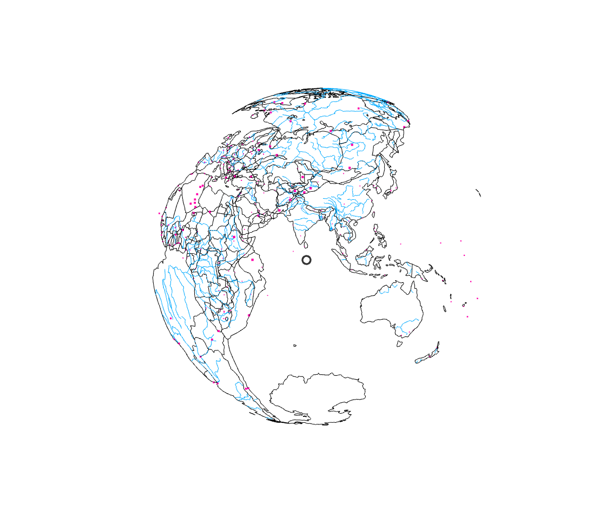
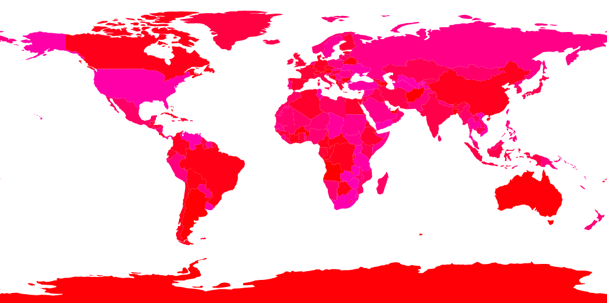
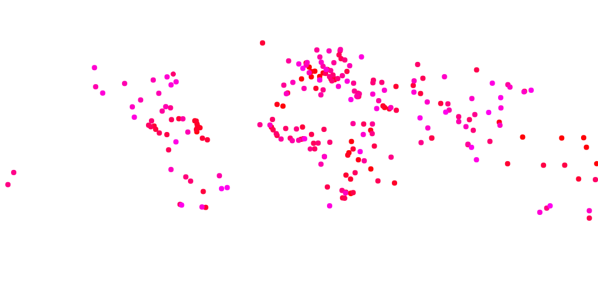

## aframe-geojson-component

A GeoJSON/TopoJSON component for easily building an orthographic globe in [A-Frame](https://aframe.io).

> Supports A-Frame 0.9.2.



### API

This library provides two components visualizing GeoJSON and TopoJSON documents as an orthographic globe. It can visualize _MultiPoints_/_Points_ as a point cloud, _MultiLineStrings_/_LineStrings_ as lines and _MultiPolygons_/_Polygons_ as an outline (no triangulated meshes!).

#### `geojson` component

The geojson component has the `material` and `geometry` components as a dependency from the entity. It implements a raycaster logic that fires an event if a GeoJSON feature gets selected.

##### Schema
| Property | Description | Default Value | Values |
| -------- | ----------- | ------------- | ------ |
| src | The GeoJSON/TopoJSON asset. |  | |
| projection | One of [D3's projection](https://github.com/d3/d3-geo/blob/master/README.md#projections). Use the function name, like "geoEquirectangular" or "geoOrthographic". Use "geoEquirectangular" if you have global data and want to wrap it around a sphere. | geoEquirectangular | See [projections](https://github.com/d3/d3-geo/blob/master/README.md#projections) |
| topologyObjct | *Only for TopoJSON*: Specifies the TopoJSON object to use (see [specification](https://github.com/topojson/topojson-specification#2-topojson-objects) for details). If empty then the first will be taken. | "" |
| featureKey | The primary key of the GeoJSON feature properties. Choose as key the property that has unique values. *Must be given*, otherwise nothing will be shown. For TopoJSON this is by specification always the _id_ property . For GeoJSON you have to select the _primary key_ | id | |
| dataSrc | The optional metadata that of this GeoJSON document. Mostly GeoJSON contains already all the associated data, however TopoJSON have always associated data sources. |  | |
| dataType | The data type of the dataSrc attribute. Only needed if _dataSrc_ is specified. | csv | csv, tsv |
| dataKey | The name of the property of the metadata that is matched to the GeoJSON's _featureKey_ attribute. Only needed if _dataSrc_ is specified. | id | |
| raycasterAccuracy | The "accuracy" of the raycaster selection. The smaller the closer you have to point with raycaster on the feature to be selected. Set smaller if you have many features close by, higher otherwise. Normalized to a generally good working condition. Unfortunately point features are not respected ... | 1 | |
| featureEventName | The event name that should be added as a listener. No events will be omitted if empty. |  | click, raycaster-intersected |
| lineWidth | The width of the line for _Polygons_ and _Line_ elements. | 1 | |
| pointScale | The scaling factor of the _Point_ data | 0.1 | |
| pointSizeFeature | Sets the size of the point using a feature. Optional. | | |
| pointAs | Shows the _Point_ data either as a point cloud or as scaled line. | point | point, line |
| omitBoundingBox | Some GeoJSON files have a bounding box border around that gives a straight line when projected on a sphere. When _true_ then this border will be ignored. | false |  |

##### Events
| Name | Data | Description |
| -------- | ----------- | ------------- |
| geojson-loaded | `{ data }`| Fired when the GeoJSON has finished loading (asynchronous operation!). `data` contains the generated GeoJSON and graphical data. |
| geojson-feature-selected | `{ feature, mesh, point }`| The selected feature and mesh by the raycaster if the _featureEventName_ parameter is given. To highlight the mesh you have to configure its _material_ property and add it to the scene. This works only with the *first* _enabled_ raycaster!  |

##### API
| Name | Data | Description |
| -------- | ----------- | ------------- |
| getMaskMesh | | Returns the mesh of the hit mask. When your geometry of the component changes (like rotation, or scaling) you must also set this changes to the mask mesh. See examples for a use case. |
| getData | | Returns a map the contains for each primary key the _properties_ object, the original 2D _point_ and the 3D world space _position_ and if applicable the _shape_ Mesh of polygon data types. May be used to display your own point visualization rather than using the default simple point visualization. |

#### `geojson-texture` component

This component so far can be just used as a texture for a geometry object (plane, sphere, etc). No feature selection events are fired. A strategy may be implemented in future releases. 

##### Schema
| Property | Description | Default Value | Values |
| -------- | ----------- | ------------- |--------|
| src | The GeoJSON/TopoJSON asset. |  | |
| topologyObjct | *Only for TopoJSON*: Specifies the TopoJSON object to use (see [specification](https://github.com/topojson/topojson-specification#2-topojson-objects) for details). If empty then the first will be taken. | | |
| canvas | The DOM canvas to use as the texture. Please set width and height to power of twos | | |
| projection | One of [D3's projection](https://github.com/d3/d3-geo/blob/master/README.md#projections) or [D3's geo projection](https://github.com/d3/d3-geo-projection). Use the function name, like "geoEquirectangular" or "geoOrthographic". Use "geoEquirectangular" if you have global data and want to wrap it around a sphere. |  'geoEquirectangular' | |
| fillColor | Polygon filling color | #fff | |
| fillOpacity | Opacity of the polygons | 1 | |
| lineColor | Line color | #fff | |
| lineOpacity | Line opacity | 1 | |
| center | The center of the projection. See the D3 documentation for details and use cases. | 0 0 | |
| rotation | The rotation of the projection. See the D3 documentation for details and use cases. | 0 0 | |


##### Events
| Name | Data | Description |
| -------- | ----------- | ------------- |
| geojson-texture-generated | _None_| Fired when the GeoJSON has finished loading (asynchronous operation!) or when the style has changed and the canvas is redrawn. You must set the _needsUpdate_ to true on your mesh map to be reflected on the mesh! |


##### API
| Name | Data | Description |
| -------- | ----------- | ------------- |
| getProjection | _None_| Returns the referenced `D3 projection` object that may be used for calculations or transformations. |
| draw | _None_| Redraws the canvas. |


### Styling
The library respects the commonly used [GeoJSON Styling Spec](https://github.com/mapbox/simplestyle-spec).
Although the spec above does not support dashed lines, it would not work anyway, because dashed lines do not work with _BufferGeometry_'s.

### Further Styling
To change the the appearnance of the points or lines just [register custom material](https://aframe.io/docs/0.6.0/components/material.html#register-a-custom-material)

* Polygons and Lines need a `THREE.LineBasicMaterial`
* Points need a  `THREE.PointsMaterial`

### Installation

#### Browser

Install and use by directly including the [browser files](dist):

```html
<head>
  <title>My A-Frame Scene</title>
  <script src="https://aframe.io/releases/0.8.0/aframe.min.js"></script>
  <script src="https://unpkg.com/aframe-geojson-component/dist/aframe-geojson-component.min.js"></script>
</head>

<body>
  <a-scene>
    <a-assets>
    <a-asset-item id="world-geojson" src="assets/world-50m.v1.json" />
    </a-assets>        

    <a-entity
      geometry="primitive: sphere; radius: 1;"
      material="color: #000;"
      geojson="
        src: #world-geojson; 
        topologyObject: countries;
        "
      />
  </a-scene>
</body>
```

<!-- If component is accepted to the Registry, uncomment this. -->
<!--
Or with [angle](https://npmjs.com/package/angle/), you can install the proper
version of the component straight into your HTML file, respective to your
version of A-Frame:

```sh
angle install aframe-geojson-component
```
-->

#### npm

Install via npm:

```bash
npm install aframe-geojson-component
```

Then require and use.

```js
require('aframe');
require('aframe-geojson-component');
```

### Large scale geometry data
If you have a GeoJSON where the geometry bounds are on a large scale, then the output will be very tiny. You have to rotate the entity and scale it up so that you can see your local data. See the _europe_ example for instance for a larger scale geometry. 
However this component is primarly for displaying orthographic low scale data (which covers the whole world). For other data its probably wiser to use a different component, like the [Mapbox component] (https://github.com/jesstelford/aframe-map/) or [Tangram component] (https://github.com/mattrei/aframe-tangram-component).

### Antimeridian Cutting
Most GeoJSON objects might show a line on the antimeridian when projected on a sphere with the equirectangular projection.

To prevent this the original GeoJSON object has to be stitched manually beforehand.

See
* https://github.com/d3/d3-geo-projection#geostitch
* https://bl.ocks.org/mbostock/3788999
for details from the great @mbostock himself.


### Implementation details
The componenet uses the D3 library to convert the GeoJSON/TopoJSON into a SVG.
The SVG is then converted into line and point _BufferGeometry_s. 

To be able to interact with the generated geometires an invisble hit mask is generated for all GeoJSON polygon, line and points to obtain the selected geojson feature via *GPU Picking* technique (much faster than raycasting).



or for point geometries



and finally for line geometries


Those various masks that are generated depending on the GeoJSON contents get then rendered off-scene and picked by the GPU.


I have seen this use case implemented by the great @thespite and enhanced it for more use cases.
